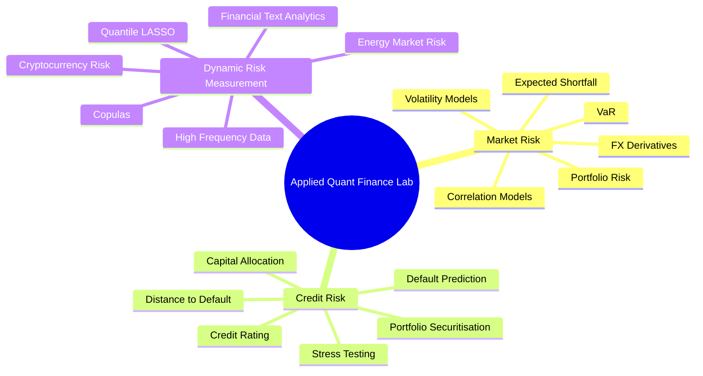
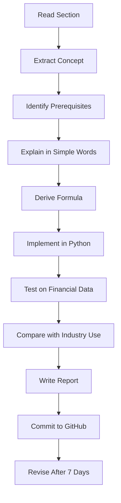
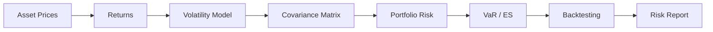
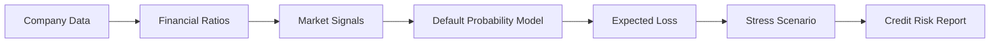
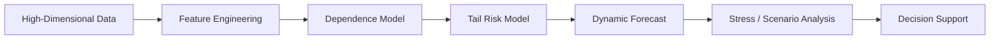
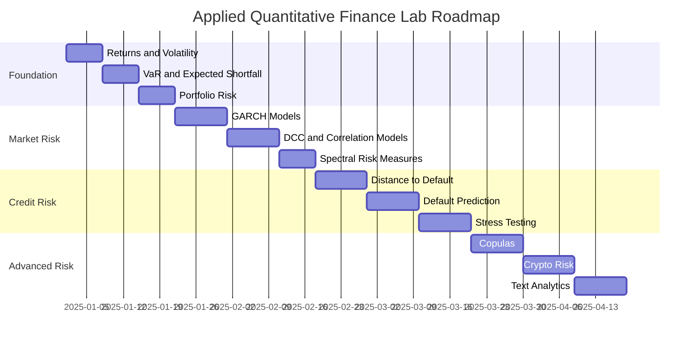
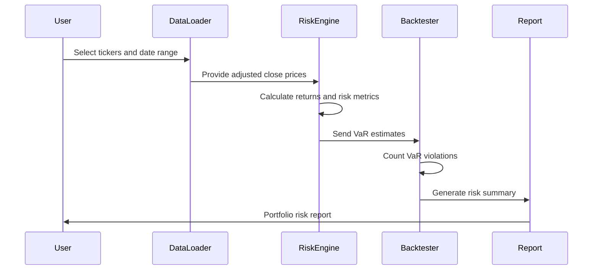
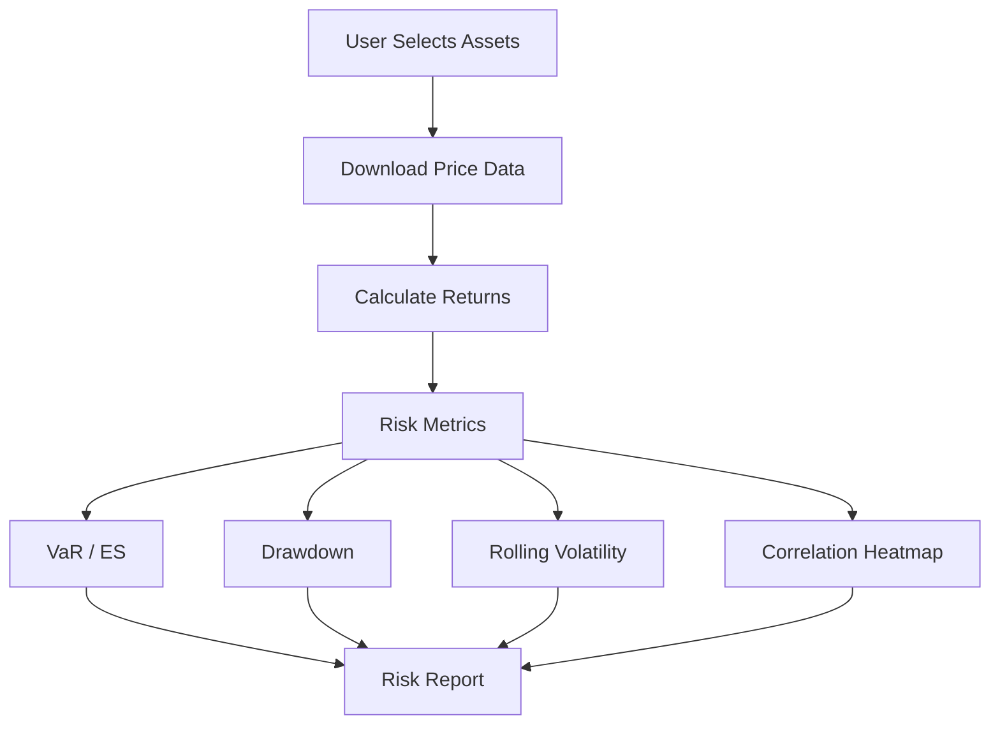
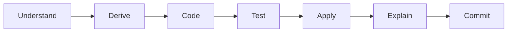

# Applied-Quantitative-Finance-Lab
# Applied Quantitative Finance Lab


> A practical, research-driven quantitative finance lab converting concepts from **Applied Quantitative Finance** into real-world Python projects used in market risk, credit risk, portfolio analytics, derivatives, volatility modelling, crypto risk, and financial text analytics.

---

## Project Mission

This repository is my structured attempt to turn advanced quantitative finance theory into **practical, job-ready projects**.

Instead of only reading formulas, this lab converts each concept into:

* clean Python implementations
* financial datasets
* research-style notebooks
* risk reports
* paper replications
* interview-ready explanations
* production-style modules
* GitHub portfolio artifacts

The goal is to build a strong practical foundation for roles such as:

* Quant Analyst
* Risk Analyst
* Market Risk Analyst
* Credit Risk Analyst
* Quantitative Researcher
* Portfolio Analyst
* Financial Data Scientist
* Derivatives / Risk Modelling Analyst

---

## Book-to-Project Philosophy


Every topic is studied using this rule:

> No concept is considered complete until it is explained, coded, tested, applied to finance, and documented.

---

## Core Theme

The book focuses heavily on **risk management** across different financial domains.

This repository therefore builds a complete applied risk platform covering:



---

## Repository Structure

```text
applied-quant-finance-lab/
│
├── README.md
├── requirements.txt
├── environment.yml
├── .gitignore
│
├── data/
│   ├── raw/
│   ├── processed/
│   └── README.md
│
├── notebooks/
│   ├── 01_market_risk/
│   │   ├── 01_returns_volatility_drawdowns.ipynb
│   │   ├── 02_var_expected_shortfall.ipynb
│   │   ├── 03_multivariate_volatility_models.ipynb
│   │   ├── 04_dcc_garch_correlation_models.ipynb
│   │   ├── 05_spectral_risk_measures.ipynb
│   │   └── 06_fx_derivatives_local_stochastic_volatility.ipynb
│   │
│   ├── 02_credit_risk/
│   │   ├── 01_distance_to_default.ipynb
│   │   ├── 02_credit_rating_models.ipynb
│   │   ├── 03_default_prediction_public_information.ipynb
│   │   ├── 04_credit_portfolio_stress_testing.ipynb
│   │   ├── 05_spectral_capital_allocation.ipynb
│   │   └── 06_credit_rating_score_analysis.ipynb
│   │
│   ├── 03_dynamic_risk_measurement/
│   │   ├── 01_high_dimensional_copulas.ipynb
│   │   ├── 02_high_frequency_risk.ipynb
│   │   ├── 03_energy_market_risk.ipynb
│   │   ├── 04_cryptocurrency_risk_analysis.ipynb
│   │   ├── 05_time_varying_quantile_lasso.ipynb
│   │   └── 06_dynamic_topic_modelling_crypto_forums.ipynb
│   │
│   └── 04_case_studies/
│       ├── market_risk_dashboard_case_study.ipynb
│       ├── credit_risk_scorecard_case_study.ipynb
│       ├── crypto_tail_risk_case_study.ipynb
│       └── portfolio_stress_testing_case_study.ipynb
│
├── src/
│   ├── data_loader.py
│   ├── returns.py
│   ├── volatility.py
│   ├── risk_metrics.py
│   ├── var_backtesting.py
│   ├── portfolio.py
│   ├── garch_models.py
│   ├── correlation_models.py
│   ├── derivatives.py
│   ├── credit_risk.py
│   ├── stress_testing.py
│   ├── copulas.py
│   ├── crypto_risk.py
│   ├── text_analytics.py
│   └── reporting.py
│
├── reports/
│   ├── page_notes/
│   ├── paper_reviews/
│   ├── industry_use_cases/
│   └── final_case_studies/
│
├── tests/
│   ├── test_returns.py
│   ├── test_volatility.py
│   ├── test_risk_metrics.py
│   ├── test_var_backtesting.py
│   ├── test_portfolio.py
│   └── test_credit_risk.py
│
├── app/
│   ├── streamlit_dashboard.py
│   └── assets/
│
└── docs/
    ├── learning_roadmap.md
    ├── prerequisites.md
    ├── finance_industry_mapping.md
    └── interview_questions.md
```

---

## Learning Architecture



---

## Main Modules

## 1. Market Risk

Market risk measures losses caused by movements in financial markets such as equities, interest rates, FX, commodities, and crypto assets.

### Topics Covered

| Topic                  | Practical Output                        | Industry Use             |
| ---------------------- | --------------------------------------- | ------------------------ |
| Returns                | return calculation engine               | portfolio analytics      |
| Volatility             | rolling and conditional volatility      | risk monitoring          |
| VaR                    | historical, parametric, Monte Carlo VaR | bank risk limits         |
| Expected Shortfall     | tail-loss estimation                    | regulatory risk          |
| GARCH                  | volatility forecasting                  | trading and risk         |
| DCC-GARCH              | dynamic correlation modelling           | portfolio VaR            |
| Spectral Risk Measures | risk aversion-weighted losses           | advanced risk allocation |
| FX Derivatives         | pricing and volatility modelling        | derivatives desk         |

### Market Risk Workflow



### Example Projects

* Build a historical VaR engine for a multi-asset portfolio
* Compare CCC vs DCC correlation models
* Backtest VaR violations using hit-rate analysis
* Implement GARCH volatility forecasting
* Create a market risk dashboard for stocks, ETFs, and crypto

---

## 2. Credit Risk

Credit risk measures the probability and severity of borrower default.

### Topics Covered

| Topic                     | Practical Output                    | Industry Use                 |
| ------------------------- | ----------------------------------- | ---------------------------- |
| Distance-to-Default       | structural credit risk model        | corporate default prediction |
| Public Information Models | default prediction model            | credit analytics             |
| Credit Rating             | rating transition analysis          | bank risk departments        |
| Stress Testing            | macro shock simulation              | regulatory capital           |
| Capital Allocation        | portfolio-level capital attribution | Basel-style risk allocation  |
| Credit Score Analysis     | scorecard modelling                 | lending and fintech          |

### Credit Risk Workflow



### Example Projects

* Estimate probability of default using logistic regression
* Build a distance-to-default model using equity market data
* Design a credit scorecard
* Stress test a loan portfolio
* Compare rating-based and market-based credit models

---

## 3. Dynamic Risk Measurement

Dynamic risk measurement focuses on changing risk over time, especially under high-dimensional, high-frequency, or alternative asset settings.

### Topics Covered

| Topic                       | Practical Output                   | Industry Use               |
| --------------------------- | ---------------------------------- | -------------------------- |
| Copulas                     | dependence and tail-risk modelling | portfolio contagion        |
| High-Frequency Data         | intraday volatility measures       | trading risk               |
| Energy Risk                 | commodity risk modelling           | energy trading desks       |
| Cryptocurrency Risk         | crypto volatility and tail-risk    | digital asset risk         |
| Time-Varying Quantile LASSO | tail-event prediction              | systemic risk              |
| Dynamic Topic Modelling     | crypto forum topic analysis        | alternative data analytics |

### Dynamic Risk Workflow



### Example Projects

* Model BTC and ETH risk using VaR and Expected Shortfall
* Use copulas to model joint crash risk
* Detect crypto community sentiment themes using topic modelling
* Build a time-varying tail-risk prediction model
* Analyze energy market volatility and price shocks

---

## Project Roadmap



---

## Practical Skill Map

```mermaid
graph TD
    A[Applied Quant Finance Lab] --> B[Math]
    A --> C[Statistics]
    A --> D[Finance]
    A --> E[Programming]
    A --> F[Research]
    A --> G[Communication]

    B --> B1[Linear Algebra]
    B --> B2[Optimization]
    B --> B3[Stochastic Processes]

    C --> C1[Regression]
    C --> C2[Time Series]
    C --> C3[Extreme Value Thinking]

    D --> D1[Market Risk]
    D --> D2[Credit Risk]
    D --> D3[Derivatives]
    D --> D4[Portfolio Management]

    E --> E1[Python]
    E --> E2[pandas / NumPy]
    E --> E3[scikit-learn]
    E --> E4[statsmodels]
    E --> E5[Streamlit]

    F --> F1[Paper Reviews]
    F --> F2[Model Replication]
    F --> F3[Empirical Testing]

    G --> G1[Risk Reports]
    G --> G2[README Documentation]
    G --> G3[Interview Explanations]
```



---

## Tech Stack

| Category         | Tools                                      |
| ---------------- | ------------------------------------------ |
| Language         | Python                                     |
| Data             | pandas, NumPy, yfinance, pandas-datareader |
| Statistics       | scipy, statsmodels                         |
| Machine Learning | scikit-learn                               |
| Risk Modelling   | arch, scipy, custom implementations        |
| Optimization     | scipy.optimize, cvxpy                      |
| Visualization    | matplotlib, plotly, seaborn                |
| Dashboard        | Streamlit                                  |
| Testing          | pytest                                     |
| Documentation    | Markdown, Mermaid diagrams                 |
| Version Control  | Git, GitHub                                |

---

## Installation

```bash
git clone https://github.com/your-username/applied-quant-finance-lab.git
cd applied-quant-finance-lab
```

Create a virtual environment:

```bash
python -m venv venv
```

Activate the environment:

```bash
# Windows
venv\Scripts\activate

# macOS / Linux
source venv/bin/activate
```

Install dependencies:

```bash
pip install -r requirements.txt
```

---

## Example `requirements.txt`

```text
numpy
pandas
scipy
statsmodels
scikit-learn
matplotlib
seaborn
plotly
yfinance
pandas-datareader
arch
cvxpy
streamlit
pytest
jupyter
notebook
```

---

## First Milestone: Market Risk Engine

The first working milestone is a complete market risk engine.

### Features

* download asset prices
* calculate simple and log returns
* calculate rolling volatility
* calculate annualized return and volatility
* compute Sharpe ratio
* compute maximum drawdown
* estimate historical VaR
* estimate parametric VaR
* estimate Expected Shortfall
* backtest VaR violations
* generate a risk report

### Workflow



---

## Example Assets

Initial experiments use liquid, well-known assets:

| Asset          | Symbol  | Reason                      |
| -------------- | ------- | --------------------------- |
| S&P 500 ETF    | SPY     | broad market exposure       |
| Apple          | AAPL    | large-cap equity            |
| Microsoft      | MSFT    | large-cap technology        |
| JPMorgan Chase | JPM     | banking sector              |
| Gold ETF       | GLD     | alternative defensive asset |
| Bitcoin        | BTC-USD | digital asset risk          |
| Crude Oil ETF  | USO     | energy market proxy         |

---

## Key Outputs

By the end of this project, the repository should contain:

```text
✅ 15+ research notebooks
✅ 10+ reusable Python modules
✅ 5+ risk case studies
✅ 10+ paper reviews
✅ 1 Streamlit dashboard
✅ unit tests for key functions
✅ visual explanations of quantitative finance concepts
✅ interview preparation notes
✅ finance-industry mapping for each model
```

---

## Page-Wise Study Template

Each page or section of the book is converted into a structured note.

```markdown
# Page / Section: Topic Name

## 1. Simple Explanation
Explain the concept in plain English.

## 2. Prerequisites
- Mathematics:
- Statistics:
- Finance:
- Programming:

## 3. Key Formula
Write the formula and define every variable.

## 4. Intuition
Explain what the formula or model is doing.

## 5. Finance Industry Use
Where is this used?
- Hedge funds:
- Banks:
- Asset managers:
- Fintech:
- Risk teams:

## 6. Practical Python Implementation
Describe what will be coded.

## 7. Dataset
Mention the data source and variables.

## 8. Research Papers
List related papers and summarize:
- Problem
- Method
- Result
- Limitation

## 9. Interview Questions
- Conceptual:
- Coding:
- Math:
- Finance application:

## 10. GitHub Artifact
Link to notebook, source file, report, or test.
```

---

## Industry Mapping

| Model / Concept     | Hedge Fund Use         | Bank Use                 | Asset Manager Use            | Fintech Use                |
| ------------------- | ---------------------- | ------------------------ | ---------------------------- | -------------------------- |
| VaR                 | risk limits            | regulatory market risk   | portfolio downside reporting | risk monitoring            |
| Expected Shortfall  | tail-risk control      | capital calculation      | stress loss estimation       | portfolio warnings         |
| GARCH               | volatility forecasting | market risk models       | tactical allocation          | volatility alerts          |
| DCC-GARCH           | dynamic correlation    | portfolio VaR            | diversification analysis     | robo-advisor risk          |
| Copulas             | crash dependence       | credit portfolio loss    | tail diversification         | systemic-risk alerts       |
| Distance-to-Default | credit short signals   | default probability      | issuer risk                  | lending models             |
| Stress Testing      | scenario research      | regulatory stress tests  | portfolio shock analysis     | lending resilience         |
| Topic Modelling     | alternative data       | compliance and sentiment | market narrative tracking    | crypto community analytics |

---

## Research Paper Review Template

Each major model is connected to at least one research paper.

```markdown
# Paper Review: Paper Title

## Citation

## Problem
What problem does the paper solve?

## Method
What model or method is used?

## Data
What data does the paper use?

## Result
What did the paper find?

## Limitation
What are the weaknesses?

## Practical Replication
How can I reproduce this with Python?

## Industry Use
How would a real financial firm use this?

## Interview Takeaway
How do I explain this in 60 seconds?
```

---

## Interview Preparation

This repository also functions as interview preparation.

### Example Questions

#### Market Risk

* What is Value-at-Risk?
* What is the weakness of VaR?
* Why is Expected Shortfall often preferred for tail risk?
* How do you backtest a VaR model?
* What is volatility clustering?
* Why use GARCH instead of simple rolling volatility?
* What is the difference between CCC and DCC correlation models?

#### Credit Risk

* What is probability of default?
* What is loss given default?
* What is exposure at default?
* What is distance-to-default?
* How can public information predict default risk?
* How do banks stress test credit portfolios?

#### Quant Modelling

* What is look-ahead bias?
* What is overfitting in financial models?
* Why is financial time series modelling difficult?
* How do you validate a risk model?
* What is the difference between correlation and tail dependence?

---

## Dashboard Plan

A Streamlit dashboard will be built for interactive risk analysis.



Dashboard sections:

* asset selector
* price chart
* return distribution
* rolling volatility
* correlation matrix
* VaR and Expected Shortfall
* maximum drawdown
* stress scenario
* downloadable risk report

---

## Progress Tracker

| Module                     | Status      | Notebook                                              | Report  |
| -------------------------- | ----------- | ----------------------------------------------------- | ------- |
| Returns and Volatility     | Not Started | `01_returns_volatility_drawdowns.ipynb`               | Pending |
| VaR and Expected Shortfall | Not Started | `02_var_expected_shortfall.ipynb`                     | Pending |
| Multivariate Volatility    | Not Started | `03_multivariate_volatility_models.ipynb`             | Pending |
| DCC-GARCH                  | Not Started | `04_dcc_garch_correlation_models.ipynb`               | Pending |
| Spectral Risk Measures     | Not Started | `05_spectral_risk_measures.ipynb`                     | Pending |
| FX Derivatives             | Not Started | `06_fx_derivatives_local_stochastic_volatility.ipynb` | Pending |
| Distance-to-Default        | Not Started | `01_distance_to_default.ipynb`                        | Pending |
| Credit Rating Models       | Not Started | `02_credit_rating_models.ipynb`                       | Pending |
| Stress Testing             | Not Started | `04_credit_portfolio_stress_testing.ipynb`            | Pending |
| Copulas                    | Not Started | `01_high_dimensional_copulas.ipynb`                   | Pending |
| Crypto Risk                | Not Started | `04_cryptocurrency_risk_analysis.ipynb`               | Pending |
| Topic Modelling            | Not Started | `06_dynamic_topic_modelling_crypto_forums.ipynb`      | Pending |

---

## How I Study Each Topic



Daily minimum:

```text
1 concept
1 explanation
1 Python function
1 finance use case
1 Git commit
```

Weekly output:

```text
1 notebook
1 report
1 paper review
1 README update
```

---

## Portfolio Goal

This repository is designed to prove the following abilities:

| Ability                        | Evidence                         |
| ------------------------------ | -------------------------------- |
| Quantitative finance knowledge | implemented models               |
| Python programming             | reusable source modules          |
| Risk modelling                 | VaR, ES, GARCH, stress testing   |
| Financial research             | paper reviews and replications   |
| Data analysis                  | real market datasets             |
| Communication                  | reports and visual explanations  |
| Job readiness                  | case studies and interview notes |

---

## Final Deliverables

By completion, this project will include:

1. A complete market risk engine
2. A credit risk modelling toolkit
3. A dynamic risk measurement module
4. A crypto and energy risk analysis module
5. A financial text analytics experiment
6. A Streamlit risk dashboard
7. Research paper reviews
8. Interview preparation notes
9. Industry-use explanations
10. A polished GitHub portfolio

---

## Disclaimer

This repository is for educational and research purposes only.
It is not financial advice, investment advice, trading advice, or a production risk management system.

---

## Author

**Dev**
Aspiring Quant / Risk / Financial Data Science Practitioner

This project documents my journey of converting advanced quantitative finance theory into practical, industry-relevant implementations.

---

## Repository Tagline

> From advanced quant finance theory to practical risk models, research notebooks, and job-ready portfolio projects.
