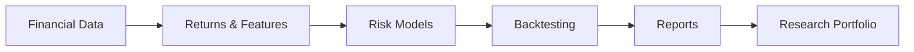
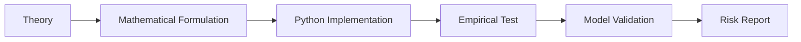

# Applied Quantitative Finance Lab

A research-oriented Python repository for implementing and validating quantitative finance models across market risk, credit risk, volatility modelling, portfolio risk, and dynamic risk measurement.

The project is based on selected topics from *Applied Quantitative Finance*, with emphasis on translating theoretical models into reproducible financial research workflows.

---

## Objective

The objective of this repository is to build a practical quantitative finance research lab covering:

* market risk measurement
* volatility and correlation modelling
* portfolio risk analytics
* credit risk modelling
* stress testing
* copula-based dependence modelling
* cryptocurrency and alternative asset risk
* financial text analytics

The focus is on clean implementation, empirical validation, and professional documentation.

---

## Project Scope



---

## Core Modules

| Module             | Focus                                              | Output                       |
| ------------------ | -------------------------------------------------- | ---------------------------- |
| Market Risk        | VaR, Expected Shortfall, drawdowns                 | portfolio risk reports       |
| Volatility Models  | GARCH, multivariate volatility                     | volatility forecasts         |
| Correlation Models | CCC, DCC-GARCH                                     | dynamic covariance estimates |
| Portfolio Risk     | allocation, diversification, risk attribution      | portfolio analytics          |
| Credit Risk        | default probability, credit rating, stress testing | credit risk models           |
| Copulas            | dependence and tail risk                           | joint loss simulations       |
| Crypto Risk        | volatility, tail risk, alternative asset behaviour | crypto risk analysis         |
| Text Analytics     | topic modelling and financial narratives           | NLP-based risk signals       |

---

## Repository Structure

```text
applied-quant-finance-lab/
│
├── README.md
├── requirements.txt
├── notebooks/
│   ├── 01_market_risk/
│   ├── 02_volatility_models/
│   ├── 03_portfolio_risk/
│   ├── 04_credit_risk/
│   ├── 05_dynamic_risk/
│   └── 06_case_studies/
│
├── src/
│   ├── data_loader.py
│   ├── returns.py
│   ├── risk_metrics.py
│   ├── volatility.py
│   ├── correlation.py
│   ├── portfolio.py
│   ├── credit_risk.py
│   ├── stress_testing.py
│   ├── copulas.py
│   └── reporting.py
│
├── reports/
│   ├── model_notes/
│   ├── paper_reviews/
│   └── case_studies/
│
├── tests/
│   └── unit_tests/
│
└── app/
    └── dashboard.py
```

---

## Methodology

Each topic follows a consistent research workflow:



For each model, the repository documents:

* assumptions
* mathematical formulation
* implementation details
* dataset used
* validation method
* limitations
* industry relevance

---

## Initial Roadmap

| Stage | Topic                          | Deliverable                          |
| ----- | ------------------------------ | ------------------------------------ |
| 1     | Returns, volatility, drawdowns | risk analytics notebook              |
| 2     | VaR and Expected Shortfall     | market risk engine                   |
| 3     | GARCH volatility models        | volatility forecasting module        |
| 4     | CCC and DCC-GARCH              | dynamic correlation model            |
| 5     | Portfolio risk                 | allocation and risk attribution      |
| 6     | Credit risk                    | default probability model            |
| 7     | Stress testing                 | scenario analysis framework          |
| 8     | Copulas                        | tail-dependence simulation           |
| 9     | Crypto risk                    | alternative asset risk report        |
| 10    | Text analytics                 | financial topic modelling experiment |

---

## Example Use Cases

* Estimate portfolio VaR and Expected Shortfall
* Backtest risk model violations
* Forecast volatility using GARCH-family models
* Estimate dynamic correlations across assets
* Stress test a multi-asset portfolio
* Model credit default probability
* Simulate joint losses using copulas
* Analyze cryptocurrency risk behaviour

---

## Technical Stack

| Area             | Tools                   |
| ---------------- | ----------------------- |
| Language         | Python                  |
| Data             | pandas, NumPy, yfinance |
| Statistics       | scipy, statsmodels      |
| Volatility       | arch                    |
| Optimization     | scipy.optimize, cvxpy   |
| Machine Learning | scikit-learn            |
| Visualization    | matplotlib, plotly      |
| Dashboard        | Streamlit               |
| Testing          | pytest                  |

---

## Installation

```bash
git clone https://github.com/your-username/applied-quant-finance-lab.git
cd applied-quant-finance-lab

python -m venv venv
source venv/bin/activate   # macOS/Linux
# venv\Scripts\activate    # Windows

pip install -r requirements.txt
```

---

## Expected Deliverables

* reusable Python modules for risk analytics
* research notebooks for each major topic
* model validation and backtesting reports
* paper summaries and implementation notes
* applied case studies using market data
* optional Streamlit dashboard for portfolio risk monitoring

---

## Professional Focus

This repository is designed to demonstrate practical capability in:

* quantitative research
* risk modelling
* empirical finance
* Python-based financial analytics
* model validation
* technical communication

---

## Disclaimer

This project is for educational and research purposes only.
It does not provide investment advice, trading recommendations, or production-grade risk management infrastructure.
